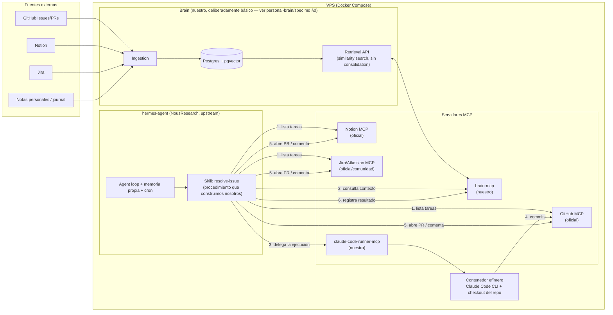

# Arquitectura general — PersonalAI

## Visión

PersonalAI tiene dos piezas que se relacionan mediante un contrato claro: **Brain expone contexto vía MCP; Hermes (hermes-agent) lo consume antes de actuar y le devuelve el resultado de sus acciones**, también vía MCP. Esto cierra el bucle de aprendizaje que describe el artículo de referencia (["Company Brain" — Layer 4: Action](https://vectorize.io/articles/how-to-build-company-brain)): un agente que actúa sin escribir de vuelta al brain nunca mejora.

**Aclaración clave**: "Hermes" es [NousResearch/hermes-agent](https://github.com/NousResearch/hermes-agent) desplegado, no un servicio que construimos desde cero. Lo que nosotros construimos son las piezas que le faltan para este caso de uso concreto: dos servidores MCP propios (`brain-mcp`, `claude-code-runner-mcp`) y un Skill que define el procedimiento de trabajo. Todo lo demás — el loop del agente, la memoria propia de hermes-agent, el gateway multi-plataforma, el cron scheduler, la delegación de subagentes — ya existe y solo se configura.



## Estructura del monorepo

```
personalAI/
  apps/
    brain/                     # servicio de memoria (Personal Brain), deliberadamente básico — ver personal-brain/spec.md §0
      src/
        ingestion/
        retrieval/               # solo similarity search en v1 — sin entidad/temporal/grafo
        api/
        # NO existe src/consolidation/ en este proyecto: diseñado en el spec, construcción
        # pospuesta a trabajo futuro del Operador (personal-brain/spec.md §4.2)
      Dockerfile
    brain-mcp/                 # servidor MCP adaptador — expone la API de Brain como tools MCP
      src/
        tools/                 # brain_query, brain_ingest, brain_record_observation
      Dockerfile
    claude-code-runner-mcp/    # servidor MCP que orquesta contenedores efímeros con Claude Code
      src/
        tools/                 # run_coding_task
        docker/                # lógica de lanzar/monitorizar/destruir contenedores (dockerode)
      Dockerfile
  hermes/
    config/
      hermes.config.yaml       # servidores MCP registrados, modelo/proveedor, cron
    skills/
      resolve-issue/           # Skill de hermes-agent (formato agentskills.io) que construimos nosotros
    docker/
      docker-compose.yml       # despliega hermes-agent (upstream) + brain + brain-mcp + claude-code-runner-mcp + postgres
  packages/
    shared/                    # tipos compartidos entre brain, brain-mcp y claude-code-runner-mcp
  docs/
    architecture.md            # este documento
    roadmap.md
    hermes/spec.md
    personal-brain/spec.md
```

Gestión del monorepo con **pnpm workspaces** para `apps/brain`, `apps/brain-mcp`, `apps/claude-code-runner-mcp` y `packages/shared` (todo TypeScript). `hermes/` no es un paquete de código propio — es configuración + el Skill (que puede ser markdown/instrucciones, según el formato de hermes-agent) para el proceso de `hermes-agent` que corre desde su propia imagen upstream.

## Contrato entre Hermes y el resto del sistema

hermes-agent no llama a nada directamente salvo a través de **MCP**. Esto es intencional y además es justo el mecanismo de extensión que el propio proyecto expone ("MCP Integration: Connect any MCP server for extended capabilities"). Dos servidores MCP cubren el contrato que nos interesa para el portfolio:

- **`brain-mcp`** expone `brain_query` (envuelve `POST /v1/query`, devuelve fragmentos por similitud — sin observations/mental models en v1) y `brain_record_observation` (envuelve `POST /v1/observations`). Ver el contrato completo en [personal-brain/spec.md](personal-brain/spec.md#52-api-vía-mcp-apps-brain-mcp-lo-que-realmente-consume-hermes).
- **`claude-code-runner-mcp`** expone `run_coding_task(repo, prompt, context)`, que hace todo el trabajo de aislamiento Docker y devuelve un resultado estructurado (éxito/fallo, diff, resumen). Ver detalle en [hermes/spec.md](hermes/spec.md#3-claude-code-runner-mcp).

GitHub, Notion y Jira se resuelven con servidores MCP **ya existentes** de esas plataformas — no construimos conectores propios para leer/escribir en ellas. Solo escribimos el "pegamento" (el Skill) que decide qué hacer con las tools que esos MCP servers exponen.

## Por qué esta separación importa para el portfolio

- Demuestra que sé **evaluar cuándo no construir algo desde cero** (usar hermes-agent en vez de reinventar un orquestador de agentes) y dónde sí aporta valor construir código propio (el runner de Claude Code, el Brain).
- Demuestra diseño de **servidores MCP** como patrón de integración — la pieza de infraestructura de agentes más relevante ahora mismo.
- Demuestra el patrón **"company brain"** aplicado con cabeza: `apps/brain` construye de verdad las capas de ingestion, retrieval y action (consumible no solo por Hermes sino por cualquier cliente MCP), y documenta con precisión la capa de consolidation como trabajo futuro en vez de fingir tenerla — ver [personal-brain/spec.md §0](personal-brain/spec.md#0-alcance-de-este-proyecto--léelo-antes-que-nada).
- Cada pieza (`brain`, `brain-mcp`, `claude-code-runner-mcp`) se puede **evaluar y presentar por separado** o como sistema integrado.

## Despliegue

Un único VPS Linux (Ubuntu 22.04/24.04) con Docker y Docker Compose:

- `hermes/docker/docker-compose.yml` levanta: `hermes-agent` (imagen oficial de NousResearch, ver su propio `Dockerfile`/`docker-compose.yml` upstream como base), `brain`, `brain-mcp`, `claude-code-runner-mcp`, `postgres` (con `pgvector`).
- `hermes-agent` se configura (`hermes/config/hermes.config.yaml` + `hermes mcp add ...`) para registrar los 5 servidores MCP (GitHub, Notion, Jira, brain-mcp, claude-code-runner-mcp).
- `claude-code-runner-mcp` es el único componente con acceso al socket de Docker del host, para lanzar los contenedores efímeros de Claude Code — ver [hermes/spec.md](hermes/spec.md#aislamiento-de-ejecución) para el detalle de seguridad de esto.
- La sesión de Claude Code compartida (`hermes-claude-auth`) es un **secreto** (token `CLAUDE_CODE_OAUTH_TOKEN`, `.env`/secret store), no un volumen Docker con archivos de sesión — ver [hermes/spec.md §0.3](hermes/spec.md#03-corrección-de-diseño--hermes-claude-auth-es-un-token-no-un-volumen-de-archivos), corregido durante la Fase 0 al verificarlo en la práctica.
- El scheduler que dispara periódicamente el Skill `resolve-issue` es el **cron nativo de hermes-agent** (`hermes cron`), no un scheduler propio.
- Reverse proxy (Caddy o Nginx) delante del gateway de hermes-agent si se quiere hablar con él desde Telegram/Discord fuera del VPS, y delante de la API de Brain si se expone para otros usos.

No se detalla más infraestructura (Terraform, Kubernetes, etc.) porque no aporta al objetivo del portfolio y añade complejidad operativa innecesaria para un proyecto personal.
