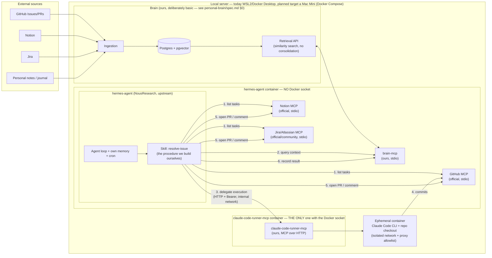

# General architecture — PersonalAI

## Vision

PersonalAI has two pieces related by a clear contract: **Brain exposes context via MCP; Hermes (hermes-agent) consumes it before acting and writes the result of its actions back**, also via MCP. This closes the learning loop described in the reference article (["Company Brain" — Layer 4: Action](https://vectorize.io/articles/how-to-build-company-brain)): an agent that acts without writing back to the brain never improves.

**Key clarification**: "Hermes" is [NousResearch/hermes-agent](https://github.com/NousResearch/hermes-agent) deployed, not a service we built from scratch. What we build are the pieces it lacks for this particular use case: two MCP servers of our own (`brain-mcp`, `claude-code-runner-mcp`) and a Skill defining the working procedure. Everything else — the agent loop, hermes-agent's own memory, the multi-platform gateway, the cron scheduler, subagent delegation — already exists and is only configured.



## Monorepo structure

```
personalAI/
  apps/
    brain/                     # memory service (Personal Brain), deliberately basic — see personal-brain/spec.md §0
      src/
        ingestion/
        retrieval/               # similarity search only in v1 — no entity/temporal/graph
        api/
        # There is NO src/consolidation/ in this project: designed in the spec, construction
        # deferred to the Operator's future work (personal-brain/spec.md §4.2)
      Dockerfile
    brain-mcp/                 # adapter MCP server — exposes Brain's API as MCP tools
      src/
        tools/                 # brain_query, brain_ingest, brain_record_observation
      Dockerfile
    claude-code-runner-mcp/    # MCP server that orchestrates ephemeral containers running Claude Code
      src/
        tools/                 # run_coding_task
        docker/                # launch/monitor/destroy container logic (dockerode)
      Dockerfile
  hermes/
    config/
      hermes.config.yaml       # registered MCP servers, model/provider, cron
    skills/
      resolve-issue/           # hermes-agent Skill (agentskills.io format) that we build ourselves
    docker/
      docker-compose.yml       # deploys hermes-agent (upstream) + brain + brain-mcp + claude-code-runner-mcp + postgres
  packages/
    shared/                    # types shared between brain, brain-mcp and claude-code-runner-mcp
  docs/
    architecture.md            # this document
    roadmap.md                 # current state and what comes next
    decisions-log.md           # the full log: every phase, every bug, every reversed decision
    agent-evals/spec.md
    hermes/spec.md
    personal-brain/spec.md
```

The monorepo is managed with **pnpm workspaces** for `apps/brain`, `apps/brain-mcp`, `apps/claude-code-runner-mcp` and `packages/shared` (all TypeScript). `hermes/` is not a code package of ours — it is configuration plus the Skill (which may be markdown/instructions, depending on hermes-agent's format) for the `hermes-agent` process that runs from its own upstream image.

## The contract between Hermes and the rest of the system

hermes-agent calls nothing directly except through **MCP**. This is intentional, and it is precisely the extension mechanism the project itself exposes ("MCP Integration: Connect any MCP server for extended capabilities"). Two MCP servers cover the contract that matters here:

- **`brain-mcp`** exposes `brain_query` (wraps `POST /v1/query`, returns fragments by similarity — no observations/mental models in v1) and `brain_record_observation` (wraps `POST /v1/observations`). Full contract in [personal-brain/spec.md](personal-brain/spec.md#52-the-mcp-api-appsbrain-mcp-what-hermes-actually-consumes).
- **`claude-code-runner-mcp`** exposes `run_coding_task(repo, prompt, context)`, which does all the Docker isolation work and returns a structured result (success/failure, diff, summary). Detail in [hermes/spec.md](hermes/spec.md#3-claude-code-runner-mcp).

GitHub, Notion and Jira are handled by those platforms' **existing** MCP servers — we build no connectors of our own to read from or write to them. We only write the "glue" (the Skill) that decides what to do with the tools those MCP servers expose.

## Why this separation matters

- It shows judgement about **when not to build something from scratch** (using hermes-agent instead of reinventing an agent orchestrator) and where building our own code does add value (the Claude Code runner, Brain).
- It demonstrates **MCP server design** as an integration pattern — currently the most relevant piece of agent infrastructure.
- It applies the **"company brain"** pattern honestly: `apps/brain` genuinely builds the ingestion, retrieval and action layers (consumable not only by Hermes but by any MCP client), and documents the consolidation layer precisely as future work instead of pretending to have it — see [personal-brain/spec.md §0](personal-brain/spec.md#0-scope-of-this-project--read-this-first).
- Each piece (`brain`, `brain-mcp`, `claude-code-runner-mcp`) can be **evaluated and presented separately** or as an integrated system.

## Deployment

A single local server, always on, with Docker and Docker Compose — rather than a VPS: for a personal-scale project like this one (see [hermes/spec.md §0](hermes/spec.md#0-aclaración-importante-qué-es-hermes-aquí)) the recurring cost of a VPS does not pay for itself, and neither the GitHub flow (polling cron, Phase 2) nor the Telegram one (long polling, Phase 3) needs inbound ports exposed to the internet or a public IP — all traffic hermes-agent generates is outbound. This does mean availability depends on the Operator's home power and network, consciously accepted given the project's personal scope.

**Reality today vs. planned target**: the deployment currently runs on WSL2/Docker Desktop on the Operator's desktop machine — there is no Mac Mini yet. A dedicated Mac Mini is the planned target (see [docs/decisions-log.md, Futuribles](decisions-log.md#futuribles-sin-fase-asignada)); the deployment design (single host, Docker Compose, no inbound ports) is the same either way, so migrating requires no redesign of anything below.

- `hermes/docker/docker-compose.yml` brings up: `hermes-agent` (image built from NousResearch's upstream, with no changes to its code), `brain`, `brain-mcp`, `claude-code-runner-mcp`, `postgres` (with `pgvector`).
- `hermes-agent` is configured (`hermes/config/hermes.config.yaml` + `hermes mcp add ...`) to register the 5 MCP servers (GitHub, Notion, Jira, brain-mcp, claude-code-runner-mcp).
- **Privilege separation (the most important design point of the deployment)**: `claude-code-runner-mcp` runs in **its own container** and is the **only** one with the Docker socket mounted; `hermes-agent` runs in a container **without** it. They communicate over MCP on Streamable HTTP in an internal Compose network, authenticated with a shared secret and with the port published neither to the host nor to the LAN.

  The reason: in Docker, being able to create containers is equivalent to full control of the host (you can create one that mounts the entire disk), and hermes-agent is precisely the component that ingests untrusted text (issue bodies) — giving it that capability turns any prompt injection into host compromise. Registering the runner over stdio would make it a subprocess of hermes and force exactly that, so it is rejected. Full requirements in [security.md](security.md) (SEC-2.1, SEC-3.1 – SEC-3.3, SEC-4.1); transport detail in [hermes/spec.md §3.5](hermes/spec.md#35-transporte-mcp-http-en-red-interna-no-stdio).

- The shared Claude Code session (`hermes-claude-auth`) is a **secret** (the `CLAUDE_CODE_OAUTH_TOKEN` token, `.env`/secret store), not a Docker volume holding session files — see [hermes/spec.md §0.3](hermes/spec.md#03-corrección-de-diseño--hermes-claude-auth-es-un-token-no-un-volumen-de-archivos), corrected during Phase 0 when verified in practice.
- The scheduler that periodically fires the `resolve-issue` Skill is **hermes-agent's native cron** (`hermes cron`), not a scheduler of ours.
- A reverse proxy (Caddy or Nginx) in front of hermes-agent's gateway only if something on the local server ever needs exposing to the internet (e.g. Brain's API for other uses) — not needed for Telegram/GitHub in v1, see the availability note above.

No further infrastructure (Terraform, Kubernetes, etc.) is specified, because it adds nothing to the project's goal and brings unnecessary operational complexity to a personal deployment.
